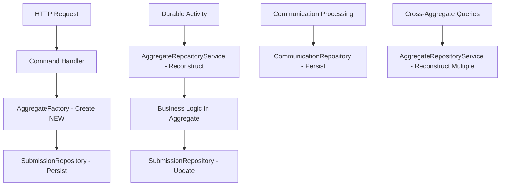

# Single Responsibility Principle (SRP) Fix

## Problem Identified

You correctly identified that the repository design was violating the **Single Responsibility Principle**. The issues were:

### ❌ Before (SRP Violations):

1. **SubmissionRepository implementing IAggregateRepository**
   - Handling both Submission AND Communication reconstruction
   - Mixed responsibilities: submission persistence + generic aggregate reconstruction

2. **Factory methods accepting objects to create objects**
   - `CreateSubmissionAggregate(Submission submission)` - Not really creating, just wrapping
   - Confusion between object creation and object reconstruction

3. **Generic responsibilities in specific repositories**
   - Each repository should only handle its own aggregate type

## ✅ Solution (SRP Compliant):

### 1. **Separated Responsibilities**

#### **IAggregateFactory** - Pure Creation
```csharp
public interface IAggregateFactory
{
    // Creates NEW aggregates from primitive values only
    SubmissionAggregate CreateNewSubmission(string blobUrl, string fileName);
    CommunicationAggregate CreateNewCommunication(Guid submissionId, string recipient, string subject, string content, string documentType);
}
```

#### **ISubmissionRepository** - Submission-Only Operations
```csharp
public interface ISubmissionRepository
{
    Task<SubmissionAggregate?> GetByIdAsync(Guid id);
    Task<SubmissionAggregate> AddAsync(SubmissionAggregate aggregate);
    Task UpdateAsync(SubmissionAggregate aggregate);
    Task<List<SubmissionStatusEntry>> GetStatusHistoryAsync(Guid submissionId);
    // Only Submission-related operations
}
```

#### **ICommunicationRepository** - Communication-Only Operations
```csharp
public interface ICommunicationRepository
{
    Task<CommunicationAggregate?> GetByIdAsync(Guid id);
    Task<List<CommunicationAggregate>> GetBySubmissionIdAsync(Guid submissionId);
    Task<CommunicationAggregate> AddAsync(CommunicationAggregate aggregate);
    Task UpdateAsync(CommunicationAggregate aggregate);
    // Only Communication-related operations
}
```

#### **IAggregateRepositoryService** - Cross-Aggregate Reconstruction
```csharp
public interface IAggregateRepositoryService
{
    // Specialized service for aggregate reconstruction
    Task<SubmissionAggregate?> ReconstructSubmissionAggregateAsync(Guid submissionId);
    Task<CommunicationAggregate?> ReconstructCommunicationAggregateAsync(Guid communicationId);
}
```

### 2. **Clear Separation of Concerns**

| Component | Responsibility | SRP Compliance |
|-----------|---------------|----------------|
| **AggregateFactory** | Create NEW aggregates from primitives | ✅ Single purpose: object creation |
| **SubmissionRepository** | Persist Submission aggregates | ✅ Single aggregate type |
| **CommunicationRepository** | Persist Communication aggregates | ✅ Single aggregate type |
| **AggregateRepositoryService** | Reconstruct ANY aggregate from persistence | ✅ Single purpose: reconstruction |

### 3. **Usage Patterns**

#### **Creating New Objects (Factory)**
```csharp
// ✅ Factory creates from business data
var newSubmission = factory.CreateNewSubmission(blobUrl, fileName);
var newCommunication = factory.CreateNewCommunication(submissionId, recipient, subject, content, type);
```

#### **Persisting Objects (Repository)**
```csharp
// ✅ Repository handles its own aggregate type
await submissionRepository.AddAsync(submissionAggregate);
await communicationRepository.AddAsync(communicationAggregate);
```

#### **Reconstructing Objects (Service)**
```csharp
// ✅ Service handles cross-aggregate reconstruction
var submission = await aggregateService.ReconstructSubmissionAggregateAsync(id);
var communication = await aggregateService.ReconstructCommunicationAggregateAsync(id);
```

## Benefits of This Approach

### 1. **Single Responsibility Principle**
- Each component has ONE reason to change
- Repositories only handle their specific aggregate type
- Factory only creates new objects
- Service only reconstructs existing objects

### 2. **Maintainability**
- Changes to Submission logic don't affect Communication repository
- Clear boundaries between creation and reconstruction
- Easy to test individual components

### 3. **Extensibility**
- Easy to add new aggregate types without modifying existing repositories
- Clear pattern for new aggregate services
- Consistent approach across the domain

### 4. **Domain Purity**
- Factory enforces business rules during creation
- Repositories focus on persistence concerns
- Service handles infrastructure concerns (reconstruction)

## Architecture Flow



## Key Takeaways

1. **Repositories should only handle their own aggregate type**
2. **Factories create new objects, not wrap existing ones**
3. **Separate services handle cross-cutting concerns like reconstruction**
4. **Each component has a single, well-defined responsibility**
5. **SRP makes the system more maintainable and testable**

This refactoring demonstrates proper application of SOLID principles in a DDD context, ensuring each component has a clear, single responsibility.