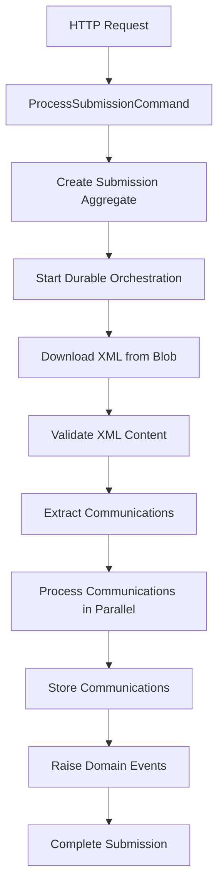

# Enhanced Document Processing Function App

## Overview

This is an enhanced Azure Function App implementing **CQRS (Command Query Responsibility Segregation)** and **DDD (Domain-Driven Design)** patterns with **Durable Functions** for processing XML documents from third-party blob storage. The solution supports two main domains: **Submissions** and **Communications** with comprehensive status tracking and event-driven architecture.

## Architecture

### Domain-Driven Design (DDD)

The solution implements DDD principles with:

- **Domain Entities**: `Submission`, `Communication`, `SubmissionStatusEntry`, `CommunicationStatusEntry`
- **Aggregates**: `SubmissionAggregate`, `CommunicationAggregate` with business logic encapsulation
- **Domain Events**: Event-driven architecture for decoupled communication
- **Aggregate Factory**: Factory pattern for creating domain aggregates
- **Repository Pattern**: Data access abstraction with EF Core

### CQRS Implementation

Clear separation between commands (write operations) and queries (read operations):

**Commands:**
- `ProcessSubmissionCommand` - Initiates blob processing workflow

**Queries:**
- `GetSubmissionStatusQuery` - Retrieves submission status
- `GetSubmissionStatusHistoryQuery` - Gets complete status history
- `GetCommunicationsQuery` - Retrieves extracted communications

### Event-Driven Architecture

Domain events are raised at key workflow stages:
- `SubmissionValidatedEvent`
- `CommunicationValidatedEvent`
- `CommunicationStoredEvent`
- `CommunicationsStoredEvent`

## Workflow

### 1. Submission Processing Pipeline



### 2. Status Tracking

Each submission and communication maintains detailed status history:

**Submission Statuses:**
- `Received` - Initial submission created
- `Processing` - XML validation in progress
- `Validated` - XML successfully validated
- `ValidationFailed` - XML validation errors
- `CommunicationsExtracted` - Communications extracted from XML
- `Completed` - All processing completed successfully
- `Failed` - Processing failed

**Communication Statuses:**
- `Extracted` - Extracted from XML
- `Validating` - Content validation in progress
- `Validated` - Content validation passed
- `ValidationFailed` - Content validation failed
- `Storing` - Being stored in database
- `Stored` - Successfully stored
- `Failed` - Processing failed

## Key Features

### 1. Third-Party Blob Storage Support

- **Azure Blob Storage**: Native support using Azure SDK
- **AWS S3**: HTTP-based download support
- **Google Cloud Storage**: HTTP-based download support
- **Custom Blob Providers**: Extensible architecture for any HTTP-accessible storage

### 2. XML Processing & Validation

- **Structure Validation**: Ensures required XML elements are present
- **Business Rule Validation**: Validates email formats, required fields
- **Error Reporting**: Detailed validation errors with line/column information
- **Communication Extraction**: Parses XML to extract individual communications

### 3. Parallel Processing with Durable Functions

- **Fan-out/Fan-in Pattern**: Process multiple communications simultaneously
- **Automatic Retry**: Built-in retry logic for transient failures
- **Checkpointing**: Automatic state persistence and recovery
- **Monitoring**: Real-time progress tracking

### 4. Comprehensive Status Tracking

- **Submission Status**: Track overall processing progress
- **Communication Status**: Individual communication processing status
- **Status History**: Complete audit trail of all status changes
- **Real-time Queries**: Monitor progress at any stage

## API Endpoints

### Submit for Processing
```http
POST /api/submissions/process
Content-Type: application/json

{
  "blobUrl": "https://storage.example.com/documents/submission.xml",
  "fileName": "submission.xml"
}
```

### Get Submission Status
```http
GET /api/submissions/{submissionId}/status
```

### Get Status History
```http
GET /api/submissions/{submissionId}/status/history
```

### Get Communications
```http
GET /api/submissions/{submissionId}/communications
```

## Configuration

### Required Settings

```json
{
  "DocumentProcessingConnectionString": "SQL Server connection string",
  "AzureWebJobsStorage": "Azure Storage for durable functions",
  "PrintingApiBaseUrl": "External printing service URL",
  "PrintingApiKey": "Authentication key for printing service"
}
```

### Database Setup

The application uses Entity Framework Core with SQL Server. Run migrations to create the database:

```bash
dotnet ef database update
```

## Expected XML Format

```xml
<?xml version="1.0" encoding="UTF-8"?>
<submission id="sub-001">
  <communications>
    <communication>
      <recipient>user@example.com</recipient>
      <subject>Document Subject</subject>
      <type>email</type>
      <content>Document content here</content>
    </communication>
  </communications>
</submission>
```

## Domain Events

The system raises events that can be consumed by external systems:

- **CommunicationsStoredEvent**: Raised when all communications are successfully stored
- Integration with message buses (Service Bus, Event Hubs) can be added for event publishing

## Testing

Use the provided test samples in `test-samples-blob.http` to test the API endpoints. The sample includes:

- Processing submissions from various blob storage providers
- Monitoring submission status and progress
- Retrieving extracted communications
- Viewing complete status history

## Deployment

### Local Development
1. Start SQL Server (LocalDB)
2. Run `func start` in the project directory
3. Test using the HTTP samples

### Azure Production
1. Deploy Function App to Azure
2. Configure application settings
3. Set up SQL Database connection
4. Configure blob storage access permissions

## Monitoring & Observability

- **Application Insights**: Built-in telemetry and performance monitoring
- **Structured Logging**: Comprehensive logging throughout the workflow
- **Status Tracking**: Real-time progress monitoring
- **Error Aggregation**: Centralized error handling and reporting

## Scalability

- **Horizontal Scaling**: Azure Functions automatically scale based on load
- **Parallel Processing**: Communications processed simultaneously
- **Database Optimization**: Indexed queries for efficient status retrieval
- **Connection Pooling**: Efficient database connection management

## Security Considerations

- **Function-level Authorization**: API endpoints protected with function keys
- **Blob Access**: Secure blob storage access with managed identities
- **SQL Injection Protection**: Parameterized queries with EF Core
- **Input Validation**: Comprehensive request validation

This enhanced solution provides a robust, scalable, and maintainable platform for processing XML documents from third-party blob storage with complete audit trails and real-time monitoring capabilities.